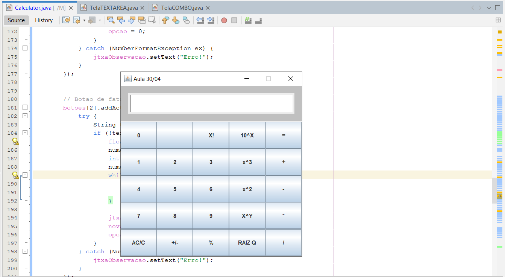

# Calculadora Gráfica em Java (POO II - UEMG)

Uma calculadora simples desenvolvida em Java utilizando a biblioteca Swing, como parte da disciplina de Programação Orientada a Objetos II na UEMG.

---

### 🚀 Sobre o Projeto

Este projeto consiste em uma aplicação de calculadora gráfica (GUI) que oferece funcionalidades básicas de aritmética e algumas operações mais avançadas. Foi desenvolvido com foco nos conceitos de Programação Orientada a Objetos e manipulação de interfaces gráficas em Java Swing.

---

### ✨ Funcionalidades Implementadas

A calculadora inclui as seguintes operações:

* **Operações Básicas:**
    * Adição (`+`)
    * Subtração (`-`)
    * Multiplicação (`*`)
    * Divisão (`/`)
* **Operações Unárias:**
    * Mudança de Sinal (`+/-`)
    * Raiz Quadrada (`RAIZ Q`)
    * Cubo (`x^3`)
    * Fatorial (`X!`)
* **Controle:**
    * Botão de Limpar/Resetar (`AC/C`)

---

### 🛠️ Tecnologias Utilizadas

* **Java:** Linguagem de programação
* **Swing:** Biblioteca para desenvolvimento de interfaces gráficas (GUI)

---

### Exemplo da Calculadora

Aqui está uma prévia de como a calculadora se parece:

---

### 📚 Disciplina e Professora

Este trabalho foi desenvolvido como parte da disciplina de **Programação Orientada a Objetos II** da **UEMG (Universidade do Estado de Minas Gerais)**.

**Professora:** Cristina Maria Valadares
